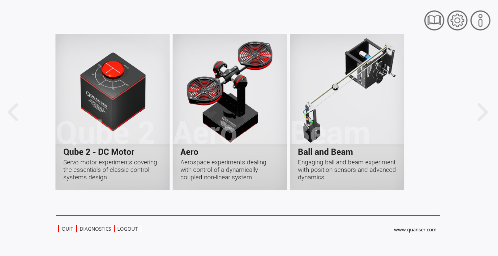
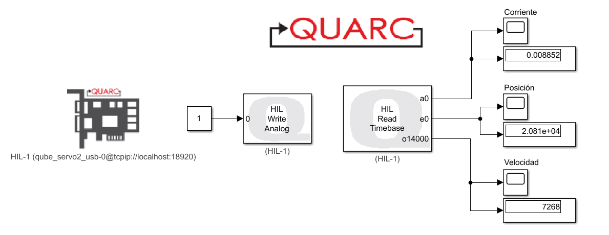
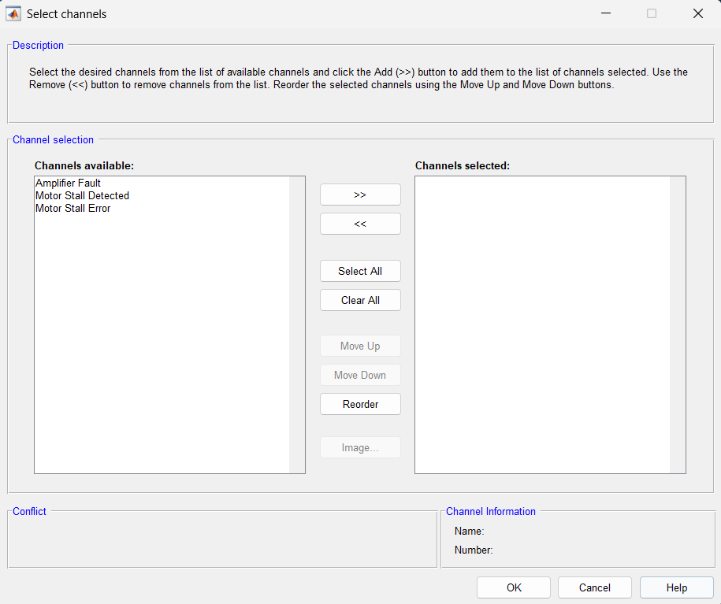

22 - abril - 2025

# Quanser y los gemelos digitales

## Introducción

En la era de la Industria 4.0 y la automatización avanzada, los gemelos digitales se han convertido en una herramienta clave para el diseño, la simulación y la optimización de sistemas físicos. Quanser se encarga de diseñar y desarrollar soluciones para la comunidad académica, especialmente en el ámbito de la ingeniería. Ofrecen una variedad de productos y plataformas que ayudan a enriquecer las experiencias prácticas de laboratorio y a permitir la investigación en ingeniería. Su objetivo es mejorar la enseñanza y los resultados de aprendizaje para estudiantes de ingeniería [1]. 

Los gemelos digitales de Quanser representan un puente innovador entre la teoría y la práctica en ingeniería de control y robótica, integrando estas tecnologías en investigaciones, permitiendo a ingenieros, académicos y estudiantes experimentar con modelos virtuales de alta precisión antes de implementarlos eb hardware real. Los gemelos digitales no solo replican el comportamiento de sistemas como robots, drones o plataformas de control.

## Gemelos Digitales.
Quanser ofrece una amplia gama de soluciones educativas, entre las que destacan sistemas como el Qube 2 - Motor DC, el módulo Aero y el Ball and Beam. Cada uno de estos equipos está especializado en un área particular de la ingeniería de control, combinando funcionalidad avanzada con una interfaz de operación intuitiva que facilita el proceso de enseñanza-aprendizaje.

Figura 1. Gemelos Digitales

### 1. Qube 2 - Motor DC
Es una plataforma educativa diseñada para le estudio práctico de sistemas de control y mecatrónico. Este sistema es integrado por un motor DC de precisión con sensores de alta resolución, permitiendo experimentar con control de posición, velocidad, corriente y dinámica rotacional. Con este sistema se puede validar algoritmos de control clásicos y avanzados, como PID, control por retroalimentación de estadoso o adaptativo. 

Figura 2. Gemelo Digital - Qube 2 Motor DC

### 2. Aero
Es un banco ee pruebas aerodinámico educativo que replica los principios fundamentales del control de vuelo en un sistema compacto. Es un sistema de 2 grados de libertad (Pitch and Yaw), permitiendo experimentar con algoritmos de control de aeronaves, desde técnicas básicas como PID hasta métodos avanzados de control multivariable. Se integran hélices independientes, sensores  de alta precisión y capacidad para simular peturbaciones.

Figura 3. Gemelo Digital - Aero

### 3. Ball and Beam
Es una plataforma educativa fundamental para el estudio práctico de control de sistemas dinámicos no lineales. Este sistema esta conformado por una barra móvil y una esfera rodante, desafía a los estudiantes a desarrollar algoritmos de control que mantengan la bola en posiciones especificas mediante el ajuste preciso del ángulo de la barra. Permite la implementación de sistemas de control PID clasicos y técnicas avanzadas como retroalimentación de estados.

Figura 4. Gemelo Digital -  Ball and Beam

### Informacion Importante
Quanser incluye manuales de usuario detallados con cada equipo adquirido. En este caso, hemos analizado específicamente el manual del Qube-Servo 3, ya que será nuestro sistema de trabajo tanto en su versión física como digital. Es importante destacar que el gemelo digital utilizado corresponde al Qube-Servo 2, cuya principal diferencia con el modelo físico radica en la ausencia del péndulo invertido. Sin embargo, esta limitación se resuelve fácilmente mediante el montaje virtual del péndulo en Simulink Multibody, lo que permite replicar todas las funcionalidades del sistema físico en el entorno de simulación.

A continuación se detallan los parámetros que se medirán durante las próximas prácticas, los cuales han sido seleccionados por su relevancia en el experimento.

| **Caracteristicas** | **Valores** |
|---------------|-----------------------------------------------|
|       Nominal Input Voltaje       |                       18 V                       |
|       Nominal Torque      |                       22.0 mmNm                       |
|      No-load Speed      |                       4000 RPM                       |
|      Nominal Speed      |                       3050 RPM                       |
|      No-load current     |                      0.022 A                     |
|      Nominal Current      |                      0.540 A                     |

Tabla 1. Parametros - Qube-Servo 3

### Formas de Conexión
Quanser ofrece tres alternativas de conexión para sus sistemas, adaptándose a distintos niveles de experiencia y requerimientos técnicos. La opción más común es mediante MATLAB/Simulink, favorecida por las librerías que simplifican el desarrollo de algoritmos de control. Para quienes prefieren un entorno más gráfico, la conexión a través de LabVIEW proporciona una interfaz intuitiva para prototipado y visualización de datos. Finalmente, tambine brinda la posibilidad de realizar una integración con sistemas embebidos, lo que requiere mayor configuración.

## Inicialización Quanser y Simulink

### 1 Conexión Simulink y Quanser
1.1. **Crea un nuevo modelo vacío en Simulink.**

1.2. **Acceso a librerías:** Abre el explorador de bibliotecas de Simulink (Simulink Library Browser) seleccionando su icono en la barra de herramientas.

1.3. **Localización de componentes QUARC:**
   QUARC Targets → Data Acquisition → Generic → Configuration

1.4. **Inserción del bloque:** Selecciona y arrastra el componente HIL Initialize a tu espacio de trabajo en Simulink.

1.5. **Configuración inicial:** Abre las propiedades del bloque con doble clic y ajusta los siguientes parámetros en la pestaña Main:

- Selecciona qube_servo2_usb en Board type
- Presiona Defaults para cargar configuraciones predeterminadas
- Especifica *0@tcpip://localhost:18920* en Board identifier (para simulación virtual con disco)
- Activa la casilla **Active during normal simulation**
- Confirma con **OK**

1.6. Accede a Model Settings (Ctrl + E) y selecciona un solver de paso fijo (Fixed-step). Ajusta el tiempo de muestreo a 0.001 segundos (1 ms) y configura el modelo en modo discreto. Esta configuración es necesaria porque los bloques de Quanser requieren un sistema de tiempo discreto para su correcto funcionamiento, garantizando alta precisión temporal y un rendimiento óptimo.

### 2. Arranque de motor y lectura de sensores
Para leer y visualizar las señales de corriente (A), velocidad (counts/s) y posición (pulsos), se debe utilizar el bloque ***HIL Read TimeBase***. Por otro lado, el arranque del motor puede controlarse mediante distintas señales de entrada, como rampa, escalón o constante, las cuales deben conectarse al bloque ***HIL Write Analog***. Una vez seleccionado este bloque, es necesario configurarlo especificando la placa de hardware a la que se vinculará el gemelo digital.

2.1. Activación de sensores
En el bloque ***HIL Read TimeBase*** se encuentra por defecto el sensor de corriente activo (*Analog channels*). Si se desea visualizar el encoder este puede activarse en *Encoder channels*, cabe recodar que Qube servo 2 cuenta con 2 encoders, depende de la necesidad si se requiere usar uno o los 2 encoders incorporados y si se desea visualizar la velocidad se debe activar en *Other channels*, en este apartado se encuentra el *Tacometro*.

Figura 5. Arranque y lectura de sensores - Qube 2

2.2 Alertas a tener en cuenta

El bloque ***HIL Read Timebase*** incluye alertas críticas (***Digital channels***) relacionadas con el funcionamiento del sistema de control en tiempo real. Entre ellas, *Amplifier Fault* señala un fallo en el amplificador de potencia, que puede deberse a sobrecalentamiento o problemas eléctricos; *Motor Stall Detected* indica que el motor se ha detenido abruptamente, generalmente por sobrecarga o bloqueo mecánico; y *Motor Stall Error* refleja un error persistente, a menudo vinculado a configuraciones incorrectas o fallos en los sensores, provocando el detenimiento del sistema y generando un analisis de errores. 

Figura 6. Alertas criticas - Qube 2

## 💡Ejemplo:
A continuación se desarrolla un lazo de control abierto mediante el método Cascada y de Austin. Para realizar el control cascada del Qube 2 Motor DC se realiza la identificación de la planta, empleando los métodos de identificación usados a lo largo del curso, dando como resultado las siguientes funciones de transferencia:
- Función de Transferencia - Corriente
  
$$G_{2} = \frac{0.008852e^{-0.0028s}}{0.0003s + 1}$$

- Función de Transferencia - Velocdidad
  
$$G_{2} = \frac{7268e^{-0.0035s}}{0.1245 + 1}$$

- Función de Transferencia - Posición
  
$$G_{2} = \frac{7268e^{-0.0035s}}{0.1245^2 + s}$$

Una vez identificada la planta se realiza el método de ITAE

# Conclusiones

2. Las alertas precentes en el *HIL Read Timebase* requieren atención inmediata para evitar daños al equipo o riesgos operativos, por lo que se recomienda verificar conexiones, reducir cargas y revisar parámetros del controlador según corresponda.

## Referencias
[1]. Home - Quanser. (2025, 18 mayo). Quanser. https://www.quanser.com/
