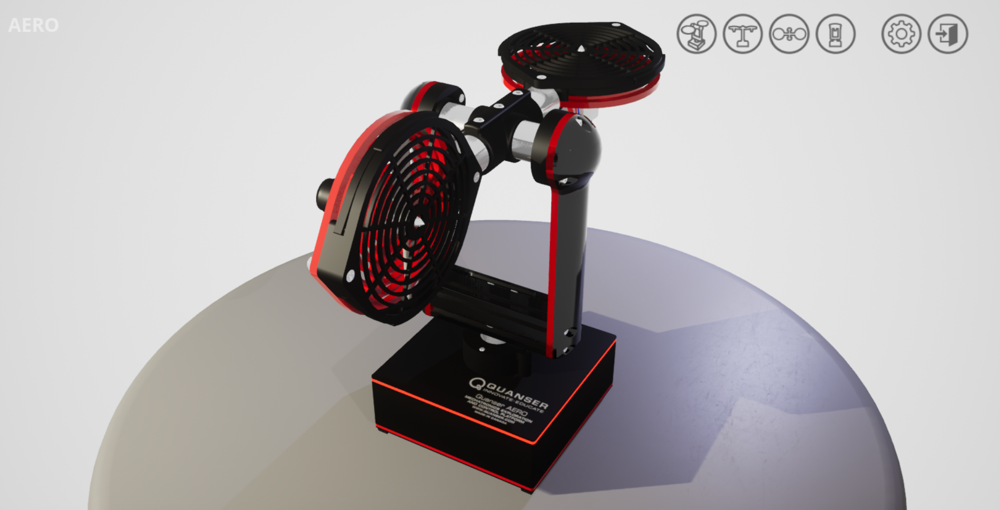

22 - abril - 2025

# Quanser y los gemelos digitales

## Introducción

En la era de la Industria 4.0 y la automatización avanzada, los gemelos digitales se han convertido en una herramienta clave para el diseño, la simulación y la optimización de sistemas físicos. Quanser se encarga de diseñar y desarrollar soluciones para la comunidad académica, especialmente en el ámbito de la ingeniería. Ofrecen una variedad de productos y plataformas que ayudan a enriquecer las experiencias prácticas de laboratorio y a permitir la investigación en ingeniería. Su objetivo es mejorar la enseñanza y los resultados de aprendizaje para estudiantes de ingeniería [1]. 

Los gemelos digitales de Quanser representan un puente innovador entre la teoría y la práctica en ingeniería de control y robótica, integrando estas tecnologías en investigaciones, permitiendo a ingenieros, académicos y estudiantes experimentar con modelos virtuales de alta precisión antes de implementarlos eb hardware real. Los gemelos digitales no solo replican el comportamiento de sistemas como robots, drones o plataformas de control.

## Gemelos Digitales.
Quanser ofrece una amplia gama de soluciones educativas, entre las que destacan sistemas como el Qube 2 - Motor DC, el módulo Aero y el Ball and Beam. Cada uno de estos equipos está especializado en un área particular de la ingeniería de control, combinando funcionalidad avanzada con una interfaz de operación intuitiva que facilita el proceso de enseñanza-aprendizaje.

### Qube 2 - Motor DC
Es una plataforma educativa diseñada para le estudio práctico de sistemas de control y mecatrónico. Este sistema es integrado por un motor DC de precisión con sensores de alta resolución, permitiendo experimentar con control de posición, velocidad, corriente y dinámica rotacional. Con este sistema se puede validar algoritmos de control clásicos y avanzados, como PID, control por retroalimentación de estadoso o adaptativo. 

Figura 1. Gemelo Digital - Qube 2 Motor DC

### Aero
Es un banco ee pruebas aerodinámico educativo que replica los principios fundamentales del control de vuelo en un sistema compacto. Es un sistema de 2 grados de libertad (Pitch and Yaw), permitiendo experimentar con algoritmos de control de aeronaves, desde técnicas básicas como PID hasta métodos avanzados de control multivariable. Se integran hélices independientes, sensores  de alta precisión y capacidad para simular peturbaciones.

Figura 2. Gemelo Digital - Aero

### Ball and Beam
Es una plataforma educativa fundamental para el estudio práctico de control de sistemas dinámicos no lineales. Este sistema esta conformado por una barra móvil y una esfera rodante, desafía a los estudiantes a desarrollar algoritmos de control que mantengan la bola en posiciones especificas mediante el ajuste preciso del ángulo de la barra. Permite la implementación de sistemas de control PID clasicos y técnicas avanzadas como retroalimentación de estados.

Figura 3. Gemelo Digital -  Ball and Beam

## Referencias
[1]. Home - Quanser. (2025, 18 mayo). Quanser. https://www.quanser.com/
